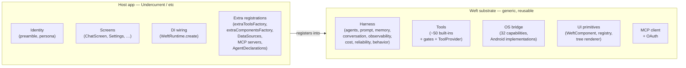
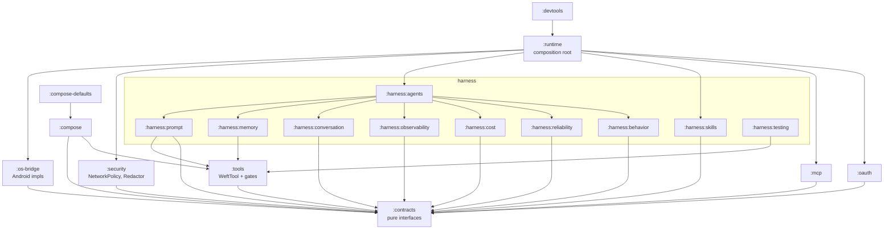
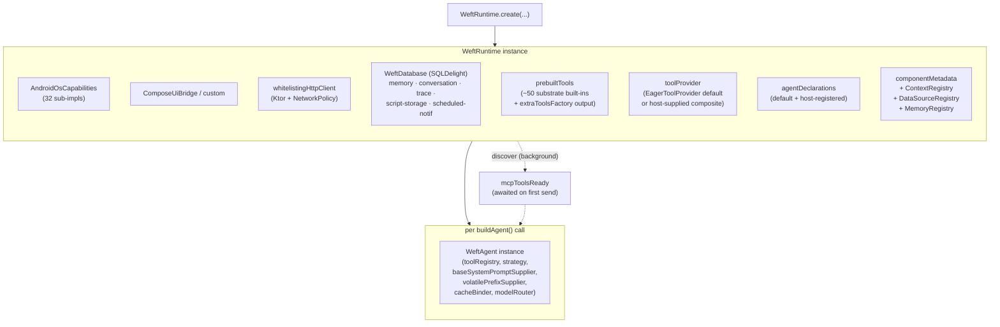
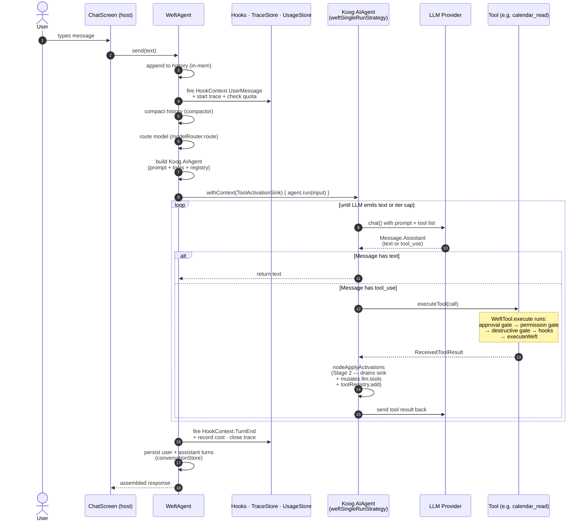
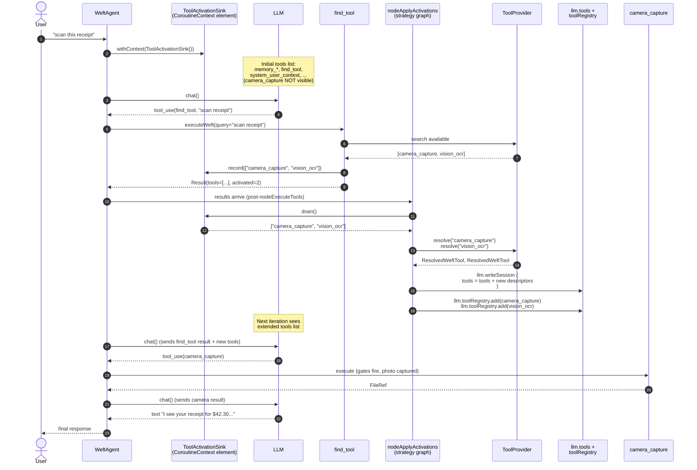
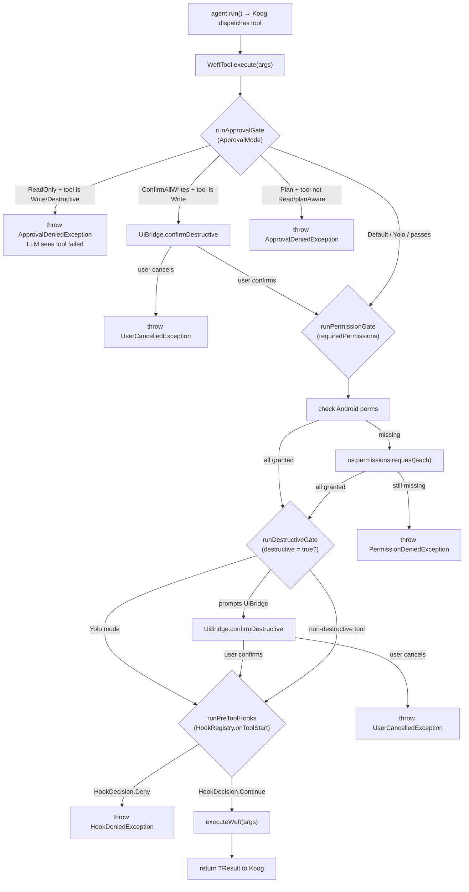
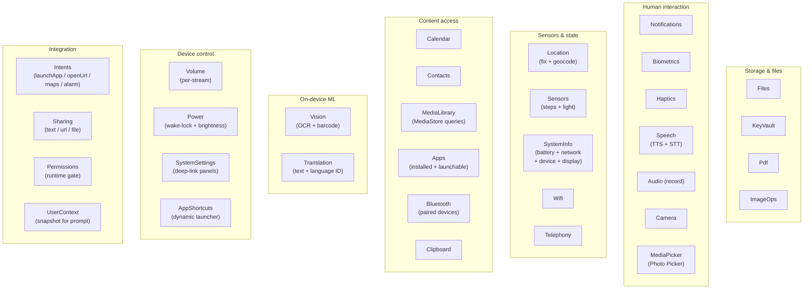
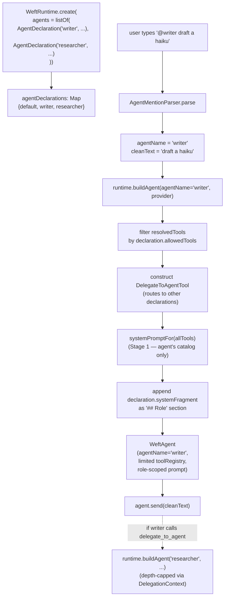
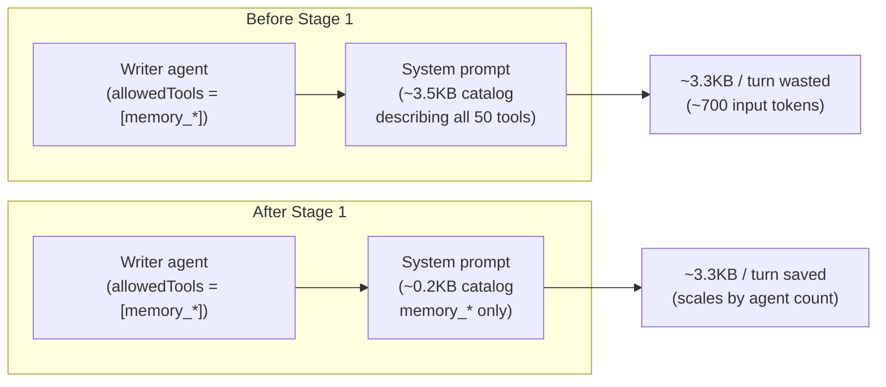

# Architecture diagrams

Visual map of how Weft fits together. Renders natively in GitHub
markdown and in mkdocs (with the mermaid plugin). Each diagram is
followed by a paragraph explaining what to take away from it.

For text-only narratives, pair this with:
- [`architecture-vision.md`](architecture-vision.md) — the SDK/host split rule
- [`02-architecture.md`](02-architecture.md) — module boundaries
- [`architecture/`](architecture/) — per-feature ADRs

---

## 1. The SDK / app boundary

The single rule everything else flows from: **the SDK provides
everything; the app just registers.**

**Takeaway.** When you're deciding where new logic belongs, ask
"would another Weft host need this same behavior?" If yes, it goes
on the left. If it's about Undercurrent's identity / branding /
screens, it stays on the right. The arrow only goes one way — the
SDK never imports anything from a host.

---

## 2. Module dependency graph

The compile-time DAG. Each node is a Gradle module; an arrow `A → B`
means `A` depends on `B`.

**Takeaway.** `:contracts` sits at the bottom — pure Kotlin
interfaces, no Android, no Koog. Everything else builds up.
`:runtime` is the composition root that wires the real
implementations. `:compose*` is the UI layer apps depend on
when they want the stock Compose surface; apps with custom UI
depend only on `:compose` (no Material).

---

## 3. The runtime — what `WeftRuntime.create` builds

**Takeaway.** `WeftRuntime` is the *expensive* object — built once
at app startup, holds every persistent store and the full tool
catalog. `WeftAgent` is the *cheap-ish* object — built per provider
× per agent declaration via `runtime.buildAgent(agentName,
provider)`. The agent captures its system prompt, tool registry,
and strategy at build time; per-turn execution is closure-driven
from there.

---

## 4. Turn lifecycle — what happens when the user types a message

The non-streaming path. Streaming is structurally identical with
delta forwarding instead of buffered assembly.

**Takeaway.** A "turn" can take many LLM round-trips internally — the
agent loops nodeCallLLM → nodeExecuteTools → (find_tool activation?)
→ nodeSendToolResult until either the LLM emits free text (done) or
hits `maxAgentIterations` (capped by strategy). The gates around
`executeWeft` mean every tool call goes through approval / permission /
destructive / hook checks before the side-effect ever fires.

---

## 5. Stage 2 — `find_tool` single-turn discovery

The interesting bit of the tool-provider redesign. The LLM searches
the catalog, the activation node mutates the agent state mid-loop,
the LLM uses the surfaced tool in the *same* user-visible turn.

**Takeaway.** The sink is the side channel between `find_tool`
(running inside the tool-dispatch coroutine) and the activation
node (sitting between `nodeExecuteTools` and `nodeSendToolResult`
in the strategy graph). Both share the same coroutine context, so
the sink passes between them without explicit plumbing. The two
mutations (`llm.tools = ...` and `toolRegistry.add(...)`) cover the
two surfaces the LLM sees: what's advertised in the prompt, and
what's dispatchable when called.

---

## 6. Tool execution — the gate stack

Every `WeftTool.execute(args)` walks this stack before
`executeWeft` runs. Each gate can short-circuit.

**Takeaway.** Every gate is opt-out: a tool that declares no
permissions skips the permission gate, a non-destructive tool skips
the destructive gate, an empty hook registry skips the hook gate.
The agent's current `ApprovalMode` (`Default`, `ReadOnly`, `Plan`,
`ConfirmAllWrites`, `Yolo`) drives the approval gate without
per-tool wiring — flipping the mode mid-session via `ApprovalModeHolder`
changes behavior without rebuilding the agent.

---

## 7. OS capabilities — domain map

The 32 sub-interfaces grouped by what they touch.

**Takeaway.** "Sensitive" capabilities (contacts, calendar, media,
location, microphone, camera) all flow through runtime-prompted
permissions. Integration capabilities (Intents, Sharing) hand off
to other apps and need no permission. ML capabilities run on-device
via ML Kit (~30MB model per language pair for translation; OCR /
barcode / language-ID models < 5MB total). Device-control
capabilities prefer per-window / Intent paths so the substrate
doesn't need WRITE_SETTINGS or similar broad permissions.

For Play-Store-shaped concerns about each of these, see
[`PLAY-POLICY.md`](PLAY-POLICY.md).

---

## 8. The lazy tool catalog (Stage 2) — what `find_tool` operates on

How `ToolProvider`, `ToolMetadata`, and the catalog assembly fit
together.

```mermaid
flowchart LR
    subgraph providers["compositeToolProvider(...)"]
        direction TB
        sub["SubstrateToolProvider<br/>(future — explicit always-on<br/>tagging of memory_*,<br/>system_user_context, ui_ask, etc.)"]
        app["AppToolProvider<br/>(host-supplied, lazy)"]
        mcp_p["McpToolProvider<br/>(future — MCP tools<br/>on-demand)"]
    end

    providers --> available["provider.available:<br/>List&lt;ToolMetadata&gt;<br/>(name, description,<br/>category, alwaysOn)"]

    available --> promptCat["System prompt catalog<br/>(only alwaysOn entries)"]
    available --> findToolSearch["find_tool ranks +<br/>returns matches"]

    findToolSearch --> sink["ToolActivationSink.record(names)"]
    sink --> node["nodeApplyActivations.drain()"]
    node --> resolve["provider.resolve(name)"]
    resolve --> resolved["ResolvedWeftTool"]
    resolved --> mutate["llm.tools += descriptor<br/>+ toolRegistry.add(tool)"]
```

**Takeaway.** `available` is the cheap, side-effect-free index —
read by both the system-prompt assembler (filtered to `alwaysOn`)
and `find_tool` (full set, ranked by query). `resolve` is the
materialization point, called only when something actually
activates. The default `EagerToolProvider` tags everything
`alwaysOn = true`, which means the catalog assembly behaves
identically to pre-Stage-2 for hosts that don't opt in. The win
materializes when the host passes a `compositeToolProvider` with
some `alwaysOn = false` items — typically MCP tools or app-domain
tools the LLM might never need this session.

---

## 9. Multi-agent — `@writer hello`

How the agent registry, declaration, and `delegate_to_agent` tool
interact.

**Takeaway.** Multi-agent is *not* multiple processes — each
addressable agent is a separate `WeftAgent` instance constructed
from the same `WeftRuntime`. They share persistence (memory, traces,
conversations), differ in tool catalog + system fragment + strategy.
`delegate_to_agent` is the substrate-supplied handoff tool; it's
only registered when the runtime has more than the default agent.
Depth is bounded via a `DelegationContext` coroutine-context element
that increments on each delegate call.

---

## 10. Per-agent prompt scoping (Stage 1) — the token-cost win

Why a writer agent with two allowed tools now pays for two
descriptions, not fifty.

**Takeaway.** Stage 1 is a 50-line change in
`buildAgentForDeclaration` that branches on `declaration.allowedTools`:
empty allowlist reuses the cached full-catalog prompt (default
agents see zero change); non-empty rebuilds against the filtered
list. Per-agent prompts don't share Anthropic cache prefix with the
default agent — for multi-agent hosts the catalog savings dominate
the cache loss.

---

## What's NOT diagrammed

Things either too detailed for a diagram, too in-flux, or both:

- The Koog graph DSL internals — see
  [`harness/agents/.../WeftStrategies.kt`](../harness/agents/src/main/kotlin/dev/weft/harness/agents/multimodal/WeftStrategies.kt)
  and the streaming variant alongside it.
- The full prompt-cache layering (system / tool catalog / older
  history / volatile) — see `CacheBinder` and
  [`07-harness.md`](07-harness.md).
- The exact SQLDelight schema — generated, owned by the migration
  files under `android/src/main/sqldelight/`.
- The MCP on-demand migration (the missing Stage 2 piece) — design
  documented but not yet implemented.

---

## Updating these diagrams

Mermaid renders in:
- GitHub markdown (web UI + many IDE plugins)
- mkdocs with `mkdocs-mermaid2-plugin` (already wired in
  [`mkdocs.yml`](../mkdocs.yml))
- Most preview tools (IntelliJ, VS Code with extensions)

When the architecture shifts, edit the diagram block in-place. Keep
the "Takeaway" paragraph paired with the diagram — the words are
what reviewers will actually read; the diagrams are what jogs the
spatial memory.
